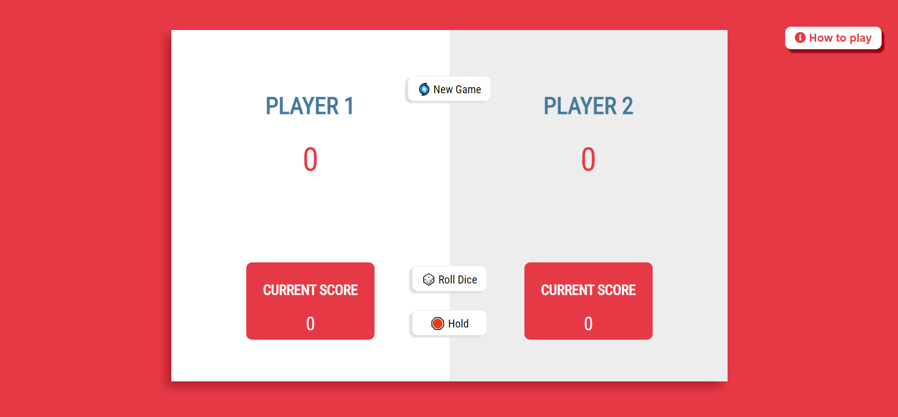

# Roll or Hold Game

## Introduction

A simple two player 🎲 game where you risk everything to see if you can score more and win the game 🏆.  
[Click to play](https://rollorholdgame-byshikhar.netlify.app/) all the best 😊

## How To Play

Each player will get a chance to roll a dice until either 1 comes on dice or player choose to Hold.

- If 1 comes on the dice then the player score nothing and it becomes next player's turn.

- If player gets any other number on the dice then that number will get added to current score and player's turn continues.

- Only if player choose to Hold then only the current score will get added to total score and the turn shift to next player.

- The player who score 50 points first will win the game.

## Technologies

HTML - CSS - JavaScript
